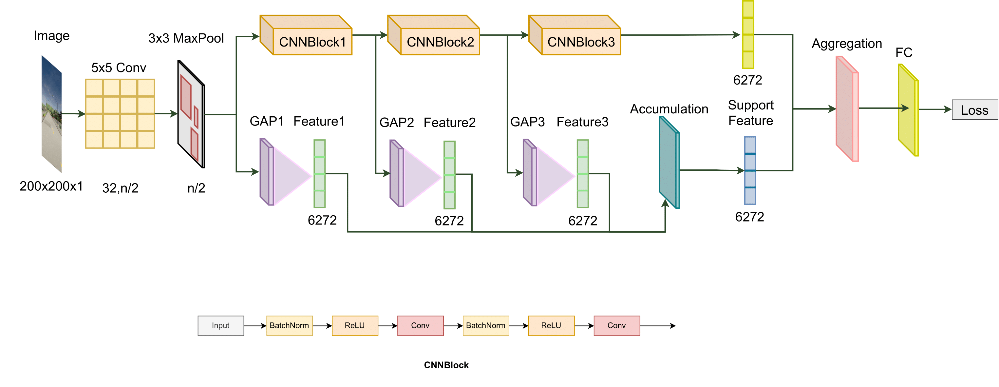

# Deep Federated Learning for Autonomous Driving

After considering the recommendations from reviewers, we have made some modification in the FADNet architecture with reserve the performance but the learning process is more stable.


*<center>**Figure 1**: The architecture of our modified Federated Autonomous Driving Net (FADNet_plus).</center>*

## Summary

* [Prerequisites](#prerequisites)
* [Datasets](#datasets)
* [Federated Learning for Autonomous Driving](#federated-learning-for-autonomous-driving)
* [Pretrained models and Testing](#pretrained-models-and-testing)
* [Citation](#citation)
* [License](#license)
* [More information](#more-information)
* [Back](https://github.com/aioz-ai/FADNet/blob/main/README.md)

### Prerequisites

PYTHON 3.6

CUDA 9.2

Please install dependence package by run following command:
```
pip install -r requirements.txt
```

### Datasets

* For GAZEBO dataset, we provide:
    * The original dataset and the split train/test dataset for GAIA network at [link](https://vision.aioz.io/f/79afffd7fc444ba9ba0d/?dl=1). You can download and extract them into "data/driving_gazebo/" folder.

* For CARLA dataset, we provide:
    * The original dataset and the split train/test dataset for GAIA network at [link](https://vision.aioz.io/f/9091c519b3904a4695ab/?dl=1). You can download and extract them into "data/driving_carla/" folder.

### Federated Learning for Autonomous Driving

Important: Before running any command lines in this section, please run following command to access 'graph_utils' folder:
```
cd graph_utils
```
And now, you are in 'graph_utils' folder.

Please download graph data at [link](https://github.com/omarfoq/communication-in-cross-silo-fl/tree/main/graph_utils/data) and put into `data` folder.

* To generate networks for GAZEBO dataset and compute the cycle time for them:
    ```
    bash generate_network_driving-gazebo.sh
    ```

* To generate networks for CARLA dataset and compute the cycle time for them:
    ```
    bash generate_network_driving-carla.sh
    ```

### Pretrained models and Testing

We provide the pretrained models for FADNet_plus which are trained on GAZEBO dataset with GAIA network by our method at the last epoch. Please download at [link](https://vision.aioz.io/f/29c444fca4f8431bb9b9/?dl=1) and extracted them into the "pretrained_models/DRIVING-GAZEBO_GAIA" folder.

You can use the "test_gazebo_gaia.sh" file for testing with the pretrained model. However, you need to modify the "--model" and "--save_logg_path" arguments from "FADNet" to "FADNet_plus".

### Citation

If you use this code as part of any published research, we'd really appreciate it if you could cite the following paper:

```
@inproceedings{nguyen2022_DFL,
  title={Deep Federated Learning for Autonomous Driving},
  author={Nguyen, Anh and Do, Tuong and Tran, Minh and Nguyen, Binh X and Duong, Chien and Phan, Tu and Tjiputra, Erman and Tran, Quang D},
  booktitle={33rd IEEE Intelligent Vehicles Symposium},
  year={2022}
}
```

### License

MIT License

### More information
AIOZ AI Homepage: https://ai.aioz.io