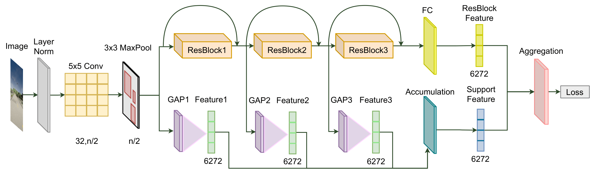

# Deep Federated Learning for Autonomous Driving

*Autonomous driving is an active research topic in both academia and industry. However, most of the existing solutions focus on improving the accuracy by training learnable models with centralized large-scale data. Therefore, these methods do not take into account the user's privacy. In this paper, we present a new approach to learn autonomous driving policy while respecting privacy concerns. We propose a peer-to-peer Deep Federated Learning (DFL) approach to train deep architectures in a fully decentralized manner and remove the need for central orchestration. We design a new Federated Autonomous Driving network (FADNet) that can improve the model stability, ensure convergence, and handle imbalanced data distribution problems while is being trained with federated learning methods. Intensively experimental results on three datasets show that our approach with FADNet and DFL achieves superior accuracy compared with other recent methods. Furthermore, our approach can maintain privacy by not collecting user data to a central server.*


*<center>**Figure 1**: The architecture of our Federated Autonomous Driving Net (FADNet).</center>*

This repository is the implementation of a decentralized federated learning approach for Autonomous Driving. We benchmark our method on three public datasets: [Udacity](), [Carla](), and [Gazebo]().

For the detail, please refer to [link](https://arxiv.org/abs/2110.05754). 

This repository is based on and inspired by @Othmane Marfoq [work](https://github.com/omarfoq/communication-in-cross-silo-fl). We sincerely thank for their sharing of the codes.

## Summary

* [Prerequisites](#prerequisites)
* [Datasets](#datasets)
* [Federated Learning for Autonomous Driving](#federated-learning-for-autonomous-driving)
* [Training](#training)
* [Pretrained models and Testing](#pretrained-models-and-testing)
* [Citation](#citation)
* [License](#license)
* [More information](#more-information)

### Prerequisites

PYTHON 3.6

CUDA 9.2

Please install dependence package by run following command:
```
pip install -r requirements.txt
```

### Datasets

* For GAZEBO dataset, we provide:
    * The original dataset and the split train/test dataset for GAIA network at [link](). You can download and extract them into "data/driving_gazebo/" folder.

* For CARLA dataset, we provide:
    * The original dataset and the split train/test dataset for GAIA network at [link](). You can download and extract them into "data/driving_carla/" folder.

### Federated Learning for Autonomous Driving

Important: Before running any command lines in this section, please run following command to access 'graph_utils' folder:
```
cd graph_utils
```
And now, you are in 'graph_utils' folder.
* To generate networks for GAZEBO dataset and compute the cycle time for them:
    ```
    bash generate_network_driving-gazebo.sh
    ```

* To generate networks for CARLA dataset and compute the cycle time for them:
    ```
    bash generate_network_driving-carla.sh
    ```

### Training

* To train our method on GAZEBO dataset with GAIA network, run:

```
bash train_gazebo_gaia.sh
```

* To train our method on CARLA dataset with GAIA network, you can use the same setup on GAZEBO.

### Pretrained models and Testing

We provide the pretrained models which are trained on GAZEBO dataset with GAIA network by our method at the last epoch. Please download at [link]() and extracted them into the "pretrained_models/DRIVING-GAZEBO_GAIA" folder.

The models can be evaluated in GAZEBO train and test set via:
```
bash test_gazebo_gaia.sh
```

### Citation

If you use this code as part of any published research, we'd really appreciate it if you could cite the following paper:

```
Updating
```

### License

MIT License

### More information
AIOZ AI Homepage: https://ai.aioz.io
